# Simplified Portfolio Architecture Plan - Single File Approach

## Project Overview

This document outlines the simplified architecture for Anu's portfolio website using a single comprehensive [`page.tsx`](app/page.tsx) file approach. The design maintains the code-like aesthetic with HTML tag styling while eliminating component complexity.

## Current Tech Stack

- **Framework**: Next.js 14 with App Router
- **Styling**: Tailwind CSS v4 with custom dark theme
- **Animations**: Framer Motion v12.18.1
- **Icons**: Lucide React v0.515.0
- **Language**: TypeScript
- **Theme**: Dark theme with orange (#ff8c00) and yellow (#ffd700) accents

## Architecture Overview

### Single-File Structure

```mermaid
graph TD
    A[Single page.tsx File] --> B[Embedded Data Objects]
    A --> C[HTML-like Section Structure]
    
    B --> B1[personalInfo object]
    B --> B2[aboutData object]
    B --> B3[educationData array]
    B --> B4[skillsData array]
    B --> B5[experienceData array]
    B --> B6[positionsData array]
    B --> B7[publicationsData array]
    B --> B8[awardsData array]
    B --> B9[socialLinks array]
    
    C --> C1[Hero Section with HTML tags]
    C --> C2[About Section with HTML tags]
    C --> C3[Skills Section with HTML tags]
    C --> C4[Education Section with HTML tags]
    C --> C5[Experience Section with HTML tags]
    C --> C6[Positions Section with HTML tags]
    C --> C7[Publications Section with HTML tags]
    C --> C8[Awards Section with HTML tags]
    C --> C9[Contact Section with HTML tags]
    C --> C10[Footer with HTML tags]
```


## Data Structure Plan

All data will be defined as TypeScript objects at the top of [`page.tsx`](app/page.tsx):

### Personal Information
```typescript
const personalInfo = {
  name: "Anu",
  title: "Full-Stack Developer",
  email: "anu@example.com",
  phone: "+1234567890",
  location: "City, Country",
  tagline: "Building amazing web experiences with modern technologies",
  bio: "Passionate full-stack developer with expertise in React, Next.js, and modern web technologies. Love creating clean, efficient code and innovative solutions."
};
```

### About Section Data
```typescript
const aboutData = {
  introduction: "I'm a passionate full-stack developer...",
  highlights: [
    "3+ years of web development experience",
    "Expertise in React, Next.js, and TypeScript",
    "Strong background in both frontend and backend technologies",
    "Passionate about clean code and user experience"
  ],
  currentFocus: "Currently focusing on modern web technologies and cloud architecture",
  interests: ["Web Development", "UI/UX Design", "Cloud Computing", "Open Source"]
};
```

### Skills Data Structure
```typescript
const skillsData = [
  {
    category: "Programming Languages",
    icon: "Code",
    skills: [
      { name: "JavaScript", level: "Expert", years: 3 },
      { name: "TypeScript", level: "Advanced", years: 2 },
      { name: "Python", level: "Intermediate", years: 2 },
      { name: "Java", level: "Intermediate", years: 1 }
    ]
  },
  {
    category: "Frontend Development",
    icon: "Monitor",
    skills: [
      { name: "React", level: "Expert", years: 3 },
      { name: "Next.js", level: "Advanced", years: 2 },
      { name: "Vue.js", level: "Intermediate", years: 1 },
      { name: "HTML/CSS", level: "Expert", years: 4 }
    ]
  },
  {
    category: "Backend Development",
    icon: "Server",
    skills: [
      { name: "Node.js", level: "Advanced", years: 2 },
      { name: "Express.js", level: "Advanced", years: 2 },
      { name: "MongoDB", level: "Intermediate", years: 2 },
      { name: "PostgreSQL", level: "Intermediate", years: 1 }
    ]
  },
  {
    category: "Tools & Technologies",
    icon: "Wrench",
    skills: [
      { name: "Git", level: "Advanced", years: 3 },
      { name: "Docker", level: "Intermediate", years: 1 },
      { name: "AWS", level: "Beginner", years: 1 },
      { name: "Figma", level: "Intermediate", years: 2 }
    ]
  }
];
```

### Education Data Structure
```typescript
const educationData = [
  {
    id: "mca",
    degree: "B.Tech in Computer Science",
    institution: "University Name",
    location: "City, Country",
    period: { start: "2020", end: "2024" },
    grade: "8.5 CGPA",
    achievements: [
      "Dean's List for 3 consecutive semesters",
      "Led final year project on web application development"
    ],
    relevantCourses: ["Data Structures", "Algorithms", "Web Development", "Database Systems"]
  },
  {
    id: "bca",
    degree: "Higher Secondary (Grade 12)",
    institution: "School Name",
    location: "City, Country",
    period: { start: "2019", end: "2020" },
    grade: "95%",
    achievements: ["School topper in Computer Science"]
  },
  {
    id: "grade10",
    degree: "Secondary (Grade 10)",
    institution: "School Name",
    location: "City, Country",
    period: { start: "2017", end: "2018" },
    grade: "92%",
    achievements: ["District level science fair winner"]
  }
];
```

### Work Experience Data Structure
```typescript
const experienceData = [
  {
    id: "exp1",
    title: "Frontend Developer",
    company: "Tech Company",
    location: "City, Country",
    period: { start: "Jan 2023", end: "Present" },
    type: "Full-time",
    description: "Developing modern web applications using React and Next.js",
    achievements: [
      "Improved application performance by 40%",
      "Led migration from legacy system to modern stack",
      "Mentored 2 junior developers"
    ],
    technologies: ["React", "Next.js", "TypeScript", "Tailwind CSS", "Node.js"]
  },
  {
    id: "exp2",
    title: "Web Development Intern",
    company: "Startup Name",
    location: "City, Country",
    period: { start: "Jun 2022", end: "Dec 2022" },
    type: "Internship",
    description: "Built responsive web applications and contributed to product development",
    achievements: [
      "Developed 3 major features from scratch",
      "Reduced bug reports by 25%"
    ],
    technologies: ["JavaScript", "React", "CSS", "MongoDB"]
  }
];
```

### Positions of Responsibility Data Structure
```typescript
const positionsData = [
  {
    id: "pos1",
    title: "Technical Lead",
    organization: "University Tech Club",
    period: { start: "Aug 2022", end: "May 2023" },
    description: "Led technical initiatives and organized coding workshops",
    responsibilities: [
      "Organized weekly coding workshops for 50+ students",
      "Led team of 8 developers in hackathon projects",
      "Coordinated with industry professionals for guest lectures"
    ],
    achievements: [
      "Increased club membership by 60%",
      "Won 2 inter-college hackathons"
    ]
  },
  {
    id: "pos2",
    title: "Event Coordinator",
    organization: "College Cultural Committee",
    period: { start: "Jan 2021", end: "Dec 2021" },
    description: "Managed technical aspects of college events",
    responsibilities: [
      "Coordinated technical setup for events",
      "Managed team of 15 volunteers",
      "Handled budget planning and vendor coordination"
    ]
  }
];
```

### Publications Data Structure
```typescript
const publicationsData = [
  {
    id: "pub1",
    title: "Modern Web Development Practices: A Comprehensive Study",
    authors: ["Anu", "Co-Author Name"],
    venue: "International Conference on Web Technologies",
    year: 2023,
    type: "Conference",
    url: "https://example.com/paper1",
    abstract: "This paper explores modern web development practices and their impact on application performance..."
  },
  {
    id: "pub2",
    title: "Performance Optimization in React Applications",
    authors: ["Anu"],
    venue: "Journal of Web Development",
    year: 2023,
    type: "Journal",
    url: "https://example.com/paper2"
  }
];
```

### Awards Data Structure
```typescript
const awardsData = [
  {
    id: "award1",
    title: "Best Final Year Project",
    issuer: "University Name",
    date: "May 2024",
    category: "Academic",
    description: "Awarded for innovative web application development project"
  },
  {
    id: "award2",
    title: "Hackathon Winner",
    issuer: "TechFest 2023",
    date: "March 2023",
    category: "Competition",
    description: "First place in 48-hour web development hackathon"
  },
  {
    id: "award3",
    title: "Dean's List",
    issuer: "University Name",
    date: "2022-2023",
    category: "Academic",
    description: "Consistent academic excellence throughout the year"
  }
];
```

### Social Links Data Structure
```typescript
const socialLinks = [
  {
    platform: "GitHub",
    url: "https://github.com/anu",
    username: "anu",
    icon: "Github",
    color: "#333"
  },
  {
    platform: "LinkedIn",
    url: "https://linkedin.com/in/anu",
    username: "anu",
    icon: "Linkedin",
    color: "#0077b5"
  },
  {
    platform: "Twitter",
    url: "https://twitter.com/anu",
    username: "@anu",
    icon: "Twitter",
    color: "#1da1f2"
  },
  {
    platform: "Email",
    url: "mailto:anu@example.com",
    username: "anu@example.com",
    icon: "Mail",
    color: "#ea4335"
  }
];
```

## HTML Tag Styling Pattern

Each section follows this consistent pattern:

```jsx
{/* Section Opening Tag */}
<div className="font-mono text-sm text-muted-foreground mb-6">
  <span className="text-blue-400">&lt;</span>
  <span className="text-green-400">section</span>
  <span className="text-yellow-400"> id</span>
  <span className="text-blue-400">=</span>
  <span className="text-orange-400">"about"</span>
  <span className="text-blue-400">&gt;</span>
</div>

{/* Section Content */}
<div className="section-content pl-4 border-l-2 border-border">
  {/* Actual section content */}
</div>

{/* Section Closing Tag */}
<div className="font-mono text-sm text-muted-foreground mt-6">
  <span className="text-blue-400">&lt;/</span>
  <span className="text-green-400">section</span>
  <span className="text-blue-400">&gt;</span>
</div>
```

## Section Layout Structure

### 1. Hero Section
- Terminal-style introduction
- Animated typing effect for tagline
- Code block with personal info object
- Navigation hints

### 2. About Section
- Personal introduction paragraph
- Highlights list with bullet points
- Current focus and interests
- Code comment decorations

### 3. Skills Section
- Grid layout (1→2→3→4 columns responsive)
- Category-based organization
- Skill level indicators
- Hover effects with glow

### 4. Education Section
- Vertical timeline layout
- Institution logos/icons
- Expandable details
- Achievement badges

### 5. Work Experience Section
- Timeline with company details
- Technology stack tags
- Achievement highlights
- Responsive card layout

### 6. Positions of Responsibility Section
- Card-based layout
- Leadership role emphasis
- Responsibility lists
- Impact metrics

### 7. Publications Section
- Academic paper format
- Citation style presentation
- External link handling
- Type-based categorization

### 8. Awards & Honors Section
- Badge/certificate style cards
- Category-based grouping
- Date-based sorting
- Achievement descriptions

### 9. Contact Section
- Contact form (optional)
- Social media links grid
- Email and location info
- Call-to-action

### 10. Footer
- Simple social links
- Copyright information
- Back to top functionality

## Responsive Design Strategy

### Breakpoint Strategy
- **Mobile (sm: 640px)**: Single column, stacked layout
- **Tablet (md: 768px)**: Two-column grids, adjusted timelines
- **Desktop (lg: 1024px)**: Multi-column layouts, full timelines
- **Large (xl: 1280px)**: Maximum width with centered content

### Grid Layouts
- Skills: `grid-cols-1 md:grid-cols-2 lg:grid-cols-3 xl:grid-cols-4`
- Awards: `grid-cols-1 md:grid-cols-2 lg:grid-cols-3`
- Social Links: `grid-cols-2 md:grid-cols-4`

## Animation Strategy

### Scroll Animations (Framer Motion)
```jsx
// Section reveal animation
const sectionVariants = {
  hidden: { opacity: 0, y: 50 },
  visible: { opacity: 1, y: 0, transition: { duration: 0.6 } }
};

// Stagger animation for lists
const containerVariants = {
  hidden: { opacity: 0 },
  visible: {
    opacity: 1,
    transition: {
      staggerChildren: 0.1
    }
  }
};
```

### CSS Animations (from tailwind.config.js)
- `animate-fade-in`: Section entrance
- `animate-slide-up`: Content reveal
- `animate-glow`: Accent elements
- Custom hover effects with `glow-hover` class

## Color Scheme (Code Syntax Highlighting)

Based on existing [`globals.css`](app/globals.css) variables:
- **HTML Tags**: `text-blue-400` (`<`, `>`, `</`)
- **Element Names**: `text-green-400` (`section`, `div`, `span`)
- **Attributes**: `text-yellow-400` (`id`, `class`, `href`)
- **Values**: `text-orange-400` (`"about"`, `"skills"`)
- **Comments**: `text-gray-500` (`<!-- -->`)
- **Background**: `bg-background` (#0a0a0a)
- **Primary**: `text-primary` (#ff8c00)
- **Secondary**: `text-secondary` (#ffd700)

## File Structure (Final)

```
app/
├── page.tsx (comprehensive single file with all sections and data)
├── layout.tsx (existing - no changes needed)
├── globals.css (existing - already configured)
└── favicon.ico
```

## Implementation Checklist

- [ ] Define all data objects at top of page.tsx
- [ ] Implement Hero section with terminal styling
- [ ] Add About section with code decorations
- [ ] Create Skills grid with categories
- [ ] Build Education timeline
- [ ] Implement Experience timeline
- [ ] Add Positions cards
- [ ] Create Publications list
- [ ] Build Awards grid
- [ ] Add Contact section
- [ ] Implement Footer
- [ ] Add Framer Motion animations
- [ ] Test responsive design
- [ ] Verify HTML tag styling
- [ ] Test all hover effects and animations

This simplified architecture maintains the professional code-like aesthetic while keeping everything in a single, manageable file.